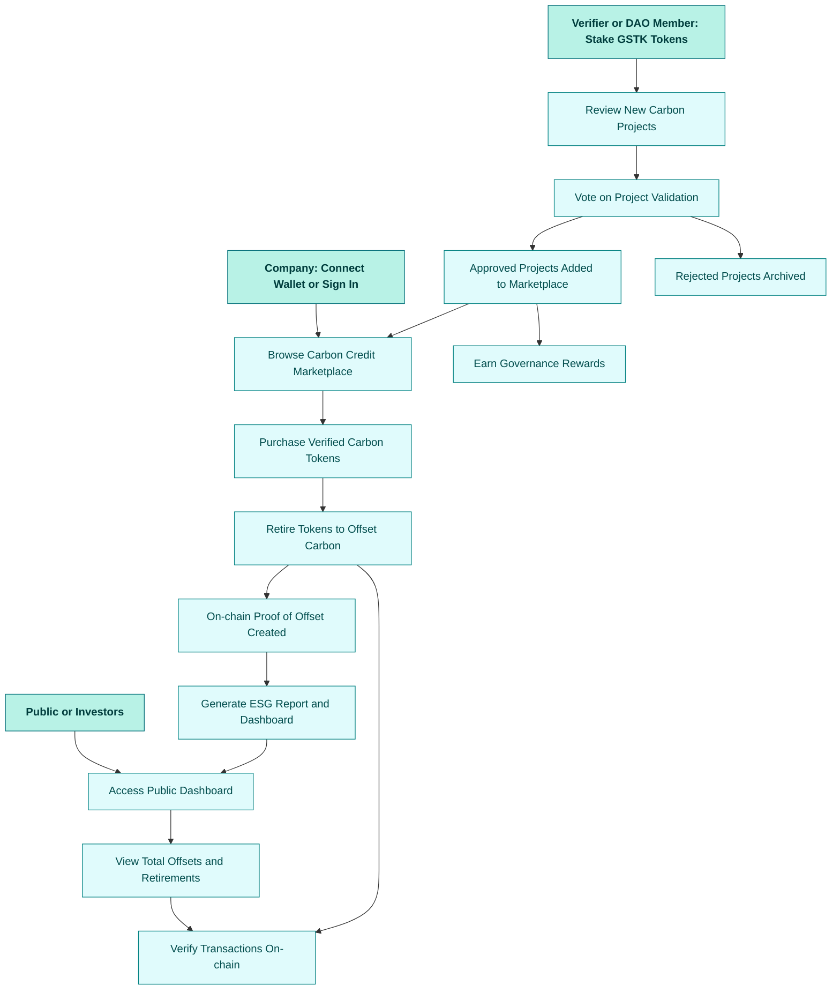

## 🌱 GreenStake

GreenStake is a tokenized carbon offset and ESG (Environmental, Social, Governance) tracking platform that enables companies to prove and verify their sustainability commitments on-chain. Built on Polygon and Solana, GreenStake transforms verified carbon credits into digital tokens, allowing businesses to transparently track, trade, and retire their offsets — eliminating greenwashing through immutable, verifiable records.

By integrating Chainlink oracles for real-world certification data and IPFS + The Graph for decentralized storage and indexing, GreenStake bridges the gap between sustainability reporting and blockchain transparency.

---

## ✨ Key Features

- **Tokenized Carbon Credits (ERC-20 / SPL):** Digitally represent verified carbon offset units with metadata (origin, verification body, certification type).
- **Transparent Offset Retirement:** Companies can burn or retire tokens to demonstrate actual emission offsets, visible on a public ledger.
- **Public ESG Dashboard:** Real-time display of verified offsets, emissions data, and sustainability metrics with blockchain proof.
- **Decentralized Verification DAO:** Community governance model for approving new carbon projects, auditing offset sources, and proposing standards.
- **API & Corporate Integration:** RESTful and GraphQL APIs for enterprise ESG data systems, sustainability reporting tools, and carbon marketplaces.
- **Oracles for Data Integrity:** Chainlink oracles fetch data from carbon certification providers (Verra, Gold Standard, UNFCCC).
- **Decentralized Storage:** IPFS for document proofs (certificates, project metadata) + The Graph for queryable ESG data indexing.

---
### 🧩 Tech Stack
| Layer             | Technologies                                 |
| ----------------- | -------------------------------------------- |
| **Smart Contracts:**      | Solidity, OpenZeppelin |
| **Oracles**      | Chainlink |
| **Frontend**       | Next.js 15, TypeScript, Ethers.js, Tailwind CSS, Zustand   |
| **Backend**    | NestJS, Prisma ORM, PostgreSQL   |
| **Storage**  | IPFS, The Graph (on-chain data indexing)|
| **Blockchain** | Solana (cross-chain support) |
| **Authentication**    | BetterAuth   |

---

## 🔄 User Flow


---

## 🏗️ Project Structure

```
greenstake/
├── contracts/                     # Solidity smart contracts
│   ├── CarbonCreditToken.sol      # ERC-20 token for carbon credits
│   ├── GreenStakeDAO.sol          # DAO governance contract
│   ├── OffsetRetirement.sol       # Retirement/burn contract
│   ├── OracleIntegration.sol      # Chainlink oracle bridge
│   └── utils/                     # Helper libraries
│
├── frontend/                      # Next.js dApp frontend
│   ├── app/                       # App router
│   │   ├── (landing)/             # Marketing pages
│   │   │   ├── about/
│   │   │   ├── partners/
│   │   │   ├── projects/
│   │   │   ├── carbon-market/
│   │   │   ├── faq/
│   │   │   ├── layout.tsx
│   │   │   └── page.tsx
│   │   ├── dashboard/             # Corporate dashboard
│   │   │   ├── overview/
│   │   │   ├── offsets/
│   │   │   ├── reports/
│   │   │   ├── governance/
│   │   │   └── layout.tsx
│   │   ├── api/                   # Next.js API routes
│   │   │   ├── offsets/
│   │   │   ├── verification/
│   │   │   └── users/
│   │   ├── auth/                  # Authentication pages
│   │   ├── error.tsx
│   │   ├── layout.tsx
│   │   └── providers.tsx
│   ├── components/                # React components
│   │   ├── charts/
│   │   ├── dashboard/
│   │   ├── governance/
│   │   ├── modals/
│   │   ├── navbar/
│   │   ├── tokens/
│   │   ├── ui/                    # Reusable UI elements
│   │   └── wallet/
│   ├── hooks/                     # Custom React hooks
│   ├── lib/                       # Utility libraries
│   ├── public/                    # Static assets
│   ├── constants/
│   ├── next.config.ts
│   ├── tailwind.config.ts
│   └── package.json
│
├── backend/                       # NestJS backend services
│   ├── src/
│   │   ├── modules/
│   │   │   ├── offsets/
│   │   │   ├── users/
│   │   │   ├── dao/
│   │   │   ├── oracle/
│   │   │   └── reporting/
│   │   ├── main.ts
│   │   └── app.module.ts
│   ├── prisma/
│   │   └── schema.prisma
│   └── package.json
│
├── graph/                         # The Graph subgraph setup
│   ├── schema.graphql
│   ├── subgraph.yaml
│   └── mappings/
│
├── scripts/                       # Deployment and migration scripts
│   ├── deploy.ts
│   └── verify.ts
│
├── test/                          # Hardhat / Foundry tests
│   ├── token.test.ts
│   ├── dao.test.ts
│   └── oracle.test.ts
│
├── docs/                          # Documentation and whitepaper
│   ├── whitepaper.md
│   ├── api-reference.md
│   └── architecture.md
│
├── .env.example                   # Example environment config
├── hardhat.config.ts              # Smart contract setup
├── tsconfig.json
└── README.md


```

---

## 🚀 Quick Start

### Prerequisites:

Node.js v18+
npm / yarn
Git
Docker (for Postgres + local blockchain)
MetaMask / WalletConnect

### Install the CLI tool:

```bash
# Clone repo
git clone https://github.com/YOUR_USERNAME/greenstake.git
cd greenstake

# Install dependencies
npm install

cp .env.example .env.local```
```
---
