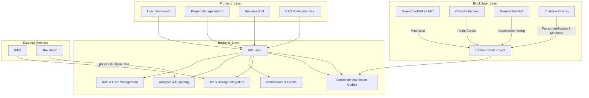

## 🌱 GreenStake

Carbon offset projects today lack transparency and verifiable tracking, making it hard for individuals and businesses to trust or participate. Manual processes, fragmented data, and limited accessibility create inefficiencies and barriers to engagement.

### Description
GreenStake introduces a blockchain-based carbon credit ecosystem with smart contracts, oracles, and decentralized storage. It enables verifiable issuance, transfer, and retirement of carbon credits, providing transparent, real-time tracking while making sustainable participation accessible to everyone.

---
## ✨ Key Features

- **Tokenized Carbon Credits (ERC-20 / SPL):** Digitally represent verified carbon offset units with metadata (origin, verification body, certification type).
- **Transparent Offset Retirement:** Companies can burn or retire tokens to demonstrate actual emission offsets, visible on a public ledger.
- **Public ESG Dashboard:** Real-time display of verified offsets, emissions data, and sustainability metrics with blockchain proof.
- **Decentralized Verification DAO:** Community governance model for approving new carbon projects, auditing offset sources, and proposing standards.
- **API & Corporate Integration:** RESTful and GraphQL APIs for enterprise ESG data systems, sustainability reporting tools, and carbon marketplaces.
- **Oracles for Data Integrity:** Chainlink oracles fetch data from carbon certification providers (Verra, Gold Standard, UNFCCC).
- **Decentralized Storage:** IPFS for document proofs (certificates, project metadata) + The Graph for queryable ESG data indexing.

---
## 🧩 Tech Stack
| Layer             | Technologies                                 |
| ----------------- | -------------------------------------------- |
| **Smart Contracts:**      | Solidity, OpenZeppelin |
| **Oracles**      | Chainlink |
| **Frontend**       | Next.js 15, TypeScript, Ethers.js, Tailwind CSS, Zustand   |
| **Backend**    | NestJS, Prisma ORM, PostgreSQL   |
| **Storage**  | IPFS, The Graph (on-chain data indexing)|
| **Blockchain** | Solana (cross-chain support) |

---

## 🔄 System Architecture

## 🏗️ Project Structure

```
greenstake/
├── contracts/                     # Solidity smart contracts
│   ├── CarbonCreditToken.sol      # ERC-20 token for carbon credits
│   ├── GreenStakeDAO.sol          # DAO governance contract
│   ├── OffsetRetirement.sol       # Retirement/burn contract
│   ├── OracleIntegration.sol      # Chainlink oracle bridge 
test/
│   ├── CarbonCreditToken.t.sol 
│   ├── GreenStakeDAO.t.sol 
│   ├── OffsetRetirement.t.sol 
│   ├── OracleIntegration.t.sol      # Chainlink oracle bridge
```

---

## 🚀 Quick Start

### Prerequisites:

Node.js v18+
npm / yarn
Git
Docker (for Postgres + local blockchain)
MetaMask / WalletConnect

### Install the CLI tool:

```bash
# Clone repo
git clone https://github.com/YOUR_USERNAME/greenstake.git
cd greenstake

# Install dependencies
npm install

cp .env.example .env.local```
```
### Deployment
#### 1. Start Local Blockchain (Anvil)
Anvil spins up a local Ethereum RPC endpoint.
```
anvil
```
#### 2. Deploy Smart Contracts
```
forge script script/DeployGreenStake.s.sol \
  --rpc-url http://localhost:8545 \
  --private-key <ANVIL_PRIVATE_KEY> \
  --broadcast -vvv
```
---
