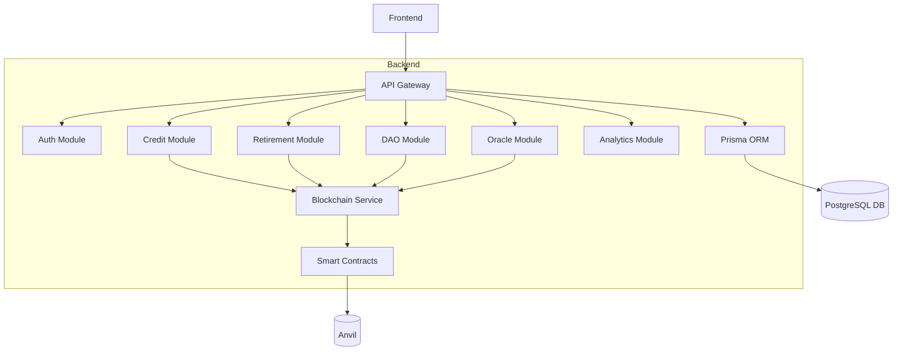

### Description
The GreenStake backend is built using NestJS, Prisma ORM, and PostgreSQL, with integrated modules for interacting with deployed smart contracts on Ethereum-compatible chains. It exposes RESTful and GraphQL APIs that allow applications to:

- Issue, query, and track tokenized carbon credits

- Process carbon credit retirements

- Fetch verified data from oracles

- Interact with the GreenStakeDAO

- Manage users, sessions, organization accounts, and reporting

---
## ✨ Key Features

- **User Authentication & Role Management:** Digitally represent verified carbon offset units with metadata (origin, verification body, certification type).
- **Carbon Credit APIs:** Issue credits (from trusted issuers), Query balances, List projects + metadata
- **Blockchain Integration:** Read/write with deployed GreenStake smart contracts, Index contract events into PostgreSQL, Ethers.js provider and signer setup.
- **ESG Analytics APIs:** Real-time sustainability metrics, Retired credits by category
- **Oracle Bridge Integration:** Fetch oracle-fed project metadata.
- **Oracles for Data Integrity:** Chainlink oracles fetch data from carbon certification providers (Verra, Gold Standard, UNFCCC).
- **DAO Governance APIs:** Create proposals, Vote on proposals, Fetch DAO history / results.

---

### How It Works

1. **Carbon Credit Issuance**
   - Verified projects mint carbon credits as NFTs via `GreenCreditToken`.
   - Each token represents a verifiable carbon offset.

2. **Oracle Verification**
   - Chainlink oracles feed project data to smart contracts.
   - Ensures legitimacy and accurate metadata.

3. **Credit Retirement**
   - Users and organizations retire credits on-chain via `OffsetRetirement`.
   - Reduces total supply and logs impact transparently.

4. **DAO Governance**
   - Token holders vote on proposals, funding, and project approvals.
   - The ecosystem is community-driven.

---

## 🔄 Architecture

## 🏗️ Project Structure

```
backend/
├── src/
│   ├── app.module.ts             # Root application module
│   ├── app.controller.ts         # Base controller
│   ├── app.service.ts            # Base service
│   ├── blockchain/
│   │   ├── blockchain.module.ts  # Smart contract integration
│   │   ├── blockchain.service.ts
│   │   └── contract-bindings/    # typechain generated files
│   ├── credits/
│   │   ├── credits.controller.ts 
│   │   ├── credits.service.ts
│   │   └── dto/
│   ├── retirement/
│   │   ├── retirement.controller.ts
│   │   ├── retirement.service.ts
│   ├── dao/
│   │   ├── dao.controller.ts
│   │   ├── dao.service.ts
│   ├── oracle/
│   │   ├── oracle.controller.ts
│   │   ├── oracle.service.ts
│   ├── analytics/
│   │   ├── analytics.controller.ts
│   │   ├── analytics.service.ts
│   ├── prisma/
│   │   ├── prisma.service.ts
│   └── common/
│       ├── dto/
│       ├── guards/
│       ├── interceptors/
│       └── utils/
│
├── test/                         # E2E tests (Jest)
├── prisma/
│   ├── schema.prisma             # Database schema
│   └── migrations/
│
├── package.json
├── tsconfig.json
├── nest-cli.json
├── .env.example
└── README.md

```

---

## 🚀 Quick Start

### Install Dependencies:

```bash
git clone https://github.com/YOUR_USERNAME/greenstake-backend.git
cd backend
pnpm install

cp .env.example .env
```
### Run Database
```
docker run -d --name pg -p 5432:5432 -e POSTGRES_PASSWORD=postgres postgres
pnpm prisma migrate dev

```
#### Start Server
```
pnpm run start:dev

```
---
